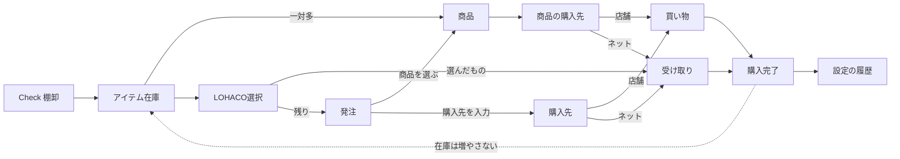

# Check＆Stock 要件定義

合意した製品要件。実装は別作業とする。

## 1. 目的

店やネットで買う「商品」と、家の在庫として数える「アイテム」を分ける。買ったことは履歴で分かり、在庫数は次の Check で合わせる。

対象は1世帯。認証・複数世帯は対象外。

## 2. ドメイン

### アイテム

Check の1行。目標数、発注閾値、場所、チェック頻度、単位を持つ。在庫数（`count`）の正とする。

購入先はアイテムにも残す。発注で商品を選ばず購入先を入力するときの候補になる。

### 商品

設定の独立セクションで管理する。項目は次のとおり。

- 名前
- 購入先（1つ以上。店舗／ネットの種別つき）
- 商品ページ URL
- バーコード

ひとつのアイテムに複数の商品が紐づく（一対多）。同じ商品を別アイテムでは使い回さない。所属アイテムは常に1つ。

付け外しはアイテム編集からも商品編集からもできる。

### 削除

商品は履歴の根拠になるため削除しない。非表示が必要なら Later。

## 3. 画面

| 画面 | 役割 |
|------|------|
| Check | 棚卸。場所・頻度で数量を入れる。在庫の正を更新する。スコープ内がすべて入力済みになると、LOHACO で買うものの選択へ進める。 |
| Select | まず LOHACO で買うアイテムを選んで一括確定する。残った要発注アイテムは、商品の選択または購入先の入力で確定する。 |
| 買い物・受け取り | 発注確定後の実行。店舗は買い物、ネットは受け取り。発注とは分ける。 |
| 設定 | アイテム、商品、履歴、既存マスタ（頻度・場所・カテゴリ・購入先）。 |

発注と買い物・受け取りは、同じ Order サブナビに横並びしない。買い物と受け取りは、分けたあとの側で切り替えてよい。

履歴は設定に置く。記録するのは「買った」「受け取り済み」のみ。項目は日時、アイテム、商品名、購入先、数量。棚卸では履歴を増やさない。履歴は在庫の再計算に使わない。

## 4. 流れ

発注を終えた行、および買い物・受け取りは、購入先 → カテゴリ でまとめる。

## 5. 発注

Check の対象スコープがすべて入力済みになると、Check から「まず LOHACO で買うものを選ぶ」へ進める。発注画面は次の順で扱う。

1. **LOHACO 選択** — 要発注アイテムにチェックを入れ、選んだものを LOHACO で一括確定する。アイテムまたは紐づく商品の購入先に LOHACO があるものは最初からチェック済みで、確定ボタンはチェックがあるとき有効。チェックしていないものは「かいものリストへ追加」で店舗の買い物リストへ移す。商品が LOHACO 向けに1件だけ紐づいていればそれを付け、複数または無しなら購入先だけで確定する。
2. **残りの発注** — 要発注アイテムを並べ、行ごとに次のいずれかで確定する。両方とも空のまま完了にはできない。

- **商品を選ぶ**（そのアイテムに紐づく商品から）。行き先はその商品の購入先になる。
- **購入先を入力する**（マスタから選ぶ、または新規入力）。商品は選ばない。アイテム側の購入先は候補として残す。

確定すると、購入先の種別（店舗／ネット）に従って買い物または受け取りへ移り、発注画面からは消える。

## 6. 買い物・受け取り

「買った」「受け取り済み」は購入完了とする。アイテムの在庫数は変えない。リストから消え、履歴が1行増える。在庫数は次の Check で合わせる。

## 7. 対象外

この文書の主対象外は次のとおり。

- 買い物リストのコピー・共有
- 欠品の部分数量
- AI 購入アドバイザーの実稼働
- 通知
- ログイン・複数世帯
- バーコードのスキャン登録 UI（バーコードは商品の属性として持つ）

## 8. 現行アプリとの関係

Check / Select / 買い物（受け取り切替）/ 設定。商品と履歴は設定。購入完了では在庫数を増やさない。クラウド用の `products` と `purchase_history` は [`supabase/setup.sql`](../supabase/setup.sql) 末尾。テーブル未作成時は端末の localStorage に持つ。
