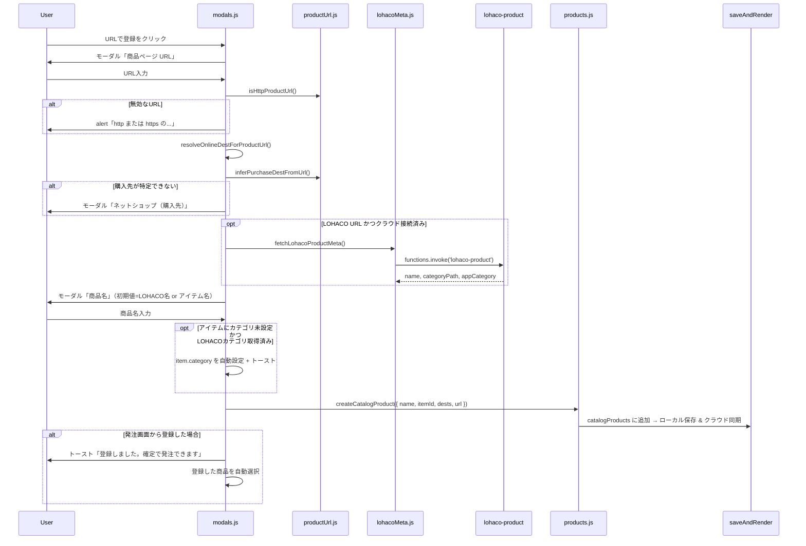

# URLで登録の動作

## 概要

「URLで登録」は、**商品ページのURLからカタログ商品を登録する**機能です（ユーザーアカウントの登録ではありません）。

登録したURLは `product.url` として保存され、発注画面から「商品ページを開く」「LOHACOでカートに入れる」などの後続操作に使われます。基本処理はブラウザ上（フロントエンド）で行われ、Supabase には通常の商品レコードとして同期されます。

LOHACO の商品ページ URL の場合のみ、クラウド接続時に Supabase Edge Function 経由で商品名・カテゴリを取得できます。

---

## 入口（3パターン）

| 入口 | UI | ファイル |
|------|-----|---------|
| A | `＋ URLで登録` ボタン | `js/ui/products.js` の `mountItemProductAddActions()` |
| B | 発注画面の商品 `<select>` → `＋ 商品ページ URLで登録` | `js/orderPlace.js` の `handlePlaceOrderProductSelectChange()` |
| C | 商品モーダルの「URL・バーコード（任意）」欄（手入力） | `js/ui/products.js` の `saveProduct()` ※URL登録フローとは別 |

**A・B** は同じコア関数 `registerProductFromUrl()`（`js/ui/modals.js`）を呼びます。**C** はURLの形式チェックなしで保存する点が異なります。

A・B が使われる場所の例:

- 設定 → アイテム編集 → 紐づく商品一覧
- 発注画面（Place order）の各行
- LOHACO商品が未登録のときの空状態

---

## 処理フロー（A・B 共通）

### ステップ詳細

1. **商品ページ URL の入力**  
   `showPrompt('商品ページ URL', '', 'url')` でモーダル表示。空またはキャンセル → 何も登録しない。

2. **URLバリデーション**
   - `http:` / `https:` のみ許可（`isHttpProductUrl()`）
   - スキーム省略時は `https://` を補完（`parseHttpUrl()`）
   - 不正な場合は alert して終了

3. **購入先（ネットショップ）の決定** — `resolveOnlineDestForProductUrl()`  
   次の優先順位で1つ選ぶ:
   - 呼び出し元から渡された `destHint`（発注画面で購入先が既に選ばれている場合）
   - URLホスト名からの推定（`inferPurchaseDestFromUrl()`）
   - アイテムに紐づくオンライン購入先が1件だけの場合 → それを使用
   - アプリ全体のオンライン購入先が1件だけの場合 → それを使用
   - 上記いずれも該当しない → ユーザーに「ネットショップ（購入先）」を入力させる（デフォルト `LOHACO`）

4. **自動推定されるホスト** — `ONLINE_STORES`（`js/productUrl.js`）:

   | ホスト | 購入先名 |
   |--------|----------|
   | `lohaco.yahoo.co.jp` | LOHACO |
   | `amazon.co.jp`, `amazon.com`, `www.amazon.co.jp` | Amazon |
   | `rakuten.co.jp`, `item.rakuten.co.jp` | 楽天 |
   | `yodobashi.com`, `www.yodobashi.com` | ヨドバシ |

   未知のホスト → ユーザー入力した名前で `ensurePurchaseDest(name, 'online')` により新規オンライン購入先を作成。

5. **LOHACO メタデータ取得（任意）** — `fetchLohacoProductMeta()`（`js/lohacoMeta.js`）  
   LOHACO 商品 URL（`/store/{sellerId}/item/{srid}`）かつクラウド接続済み（`isCloudReady()`）のとき、Supabase Edge Function `lohaco-product` を呼び出す。
   - 成功時: 商品名の初期値に LOHACO の商品名を使用（`LOHACO - ` プレフィックスは除去）
   - アイテムにカテゴリが未設定の場合、LOHACO カテゴリからアプリのカテゴリを推定して自動設定（トーストで通知、Undo 可）
   - 失敗時・オフライン時: 従来どおりアイテム名を初期値にする（登録自体は続行）

6. **商品名の入力**  
   デフォルトは LOHACO 取得名、なければアイテム名。空またはキャンセル → 登録しない。

7. **商品作成** — `createCatalogProduct()`（`js/products.js`）  
   - 新ID生成、名前・`itemId`・購入先1件・正規化済みURLを `catalogProducts` に追加
   - URLは `normalizeProductPageUrl()` で正規化

8. **保存**  
   `saveAndRender()` でローカルストレージ保存 + Supabase 同期（`products.url` カラム）。

---

## 発注画面から登録した場合の追加動作

`handlePlaceOrderProductSelectChange()`（`js/orderPlace.js`）→ `finishOrderProductRegistration()`（`js/order.js`）:

- 成功時: トースト表示、`pendingProductSelect` に `{ itemId, productId }` をセットし再描画 → **登録した商品が自動選択**される
- キャンセル/失敗時: 商品 `<select>` を空に戻す

---

## 登録後にURLが使われる場面

| 用途 | 処理 |
|------|------|
| 商品名・URLリンク表示 | `productPageUrl()` / `createProductPageLink()` |
| 発注行の「LOHACOで開く」等 | `onlineProductAccessLinks()` |
| LOHACO「カートに入れる」 | URLパス `/store/{sellerId}/item/{srid}` を解析 → `lohacoCartAddUrl()` |
| LOHACO判定 | `productHasLohaco()` — 購入先にLOHACOがなくてもURLがLOHACOならLOHACO商品扱い |

LOHACOカート追加URLの形式:
`https://lohaco.yahoo.co.jp/cartAdd/{sellerId}/{srid}/?stockAddress=0`

---

## キャンセル・エラー時の挙動

- 各モーダルでキャンセル → `null` を返し、商品は作成されない
- URL形式エラー → alert のみ（商品未作成）
- 購入先プロンプトを空でキャンセル → 商品未作成
- 発注画面から開始した場合、失敗時はドロップダウン選択がリセットされる
- LOHACO メタ取得失敗 → 商品名はアイテム名が初期値のまま、登録は続行

---

## 「名前だけ追加」との違い

| | URLで登録 | 名前だけ追加 |
|--|-----------|--------------|
| 入力 | URL → 購入先（必要時）→ 商品名 | 商品名のみ |
| 購入先 | URLから推定 or プロンプトで確保 | アイテム/行の購入先が必要（なければ alert） |
| URL保存 | あり | なし |
| LOHACO メタ取得 | あり（クラウド接続時） | なし |

---

## バックエンドの関与

- **LOHACO のみ** — Edge Function `supabase/functions/lohaco-product/index.ts` が Yahoo Shopping API から商品名・カテゴリを取得
- **その他の店** — スクレイピングやメタデータ取得は行わない
- DBは `supabase/products.sql` の `url text` カラムに文字列として保存
- マッピング: `js/db/mapper.js` の `productToDbRow` / `productFromRow`

---

## 補足: ブラウザURLのクエリパラメータ

アプリの `window.location.search` 等を読んで登録する**ディープリンク機能はありません**。「URLで登録」の「URL」は、ユーザーが入力する**商品ページのURL**を指します。
